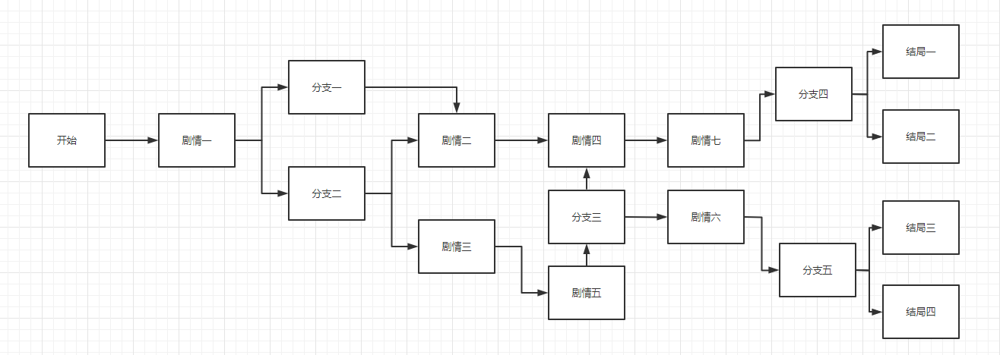

# 简单的分支剧情

创建简单的线性剧情是非常简单的，只需要用到 [__事件__](../domain/event.md) 与  [__选项__](../domain/option.md) ，有可能会用到 [__
分支__](../domain/branch.md)

1. 创作剧情线

剧情最重要的是剧情线，也就是故事在什么时间，该如何发展。一般情况下，分支剧情的走向都和下图类似：



也就是需要创作者先确定好每一个剧情分支间的关系，并确定好其文本表述。

2. 创建事件与选项

其实这里创建的事件也就是剧情，这里可以创建带有选项的事件，用于做一些信息补充或是分支更改。

```json
{
  "events": [
    {
      "followEvents": [
        "十字路口说明"
      ],
      "name": "十字路口",
      "remain": -1,
      "desc": "你到达了十字路口，接下来该往哪儿走？",
      "print": "你站在十字路口。"
    },
    {
      "name": "向前",
      "remain": -1,
      "desc": "你来到..."
    },
    {
      "name": "向左",
      "remain": -1,
      "desc": "你来到..."
    },
    {
      "name": "向右",
      "remain": -1,
      "desc": "你来到..."
    },
    {
      "name": "十字路口说明",
      "remain": -1,
      "desc": "你看了下路标，这里是XXXXXXX，XXXX就在这附近吧。"
    }
  ],
  "options": [
    {
      "followEvents": [
        "十字路口"
      ],
      "name": "向左",
      "desc": "向左走",
      "linkEvent": "向左",
      "print": "你向左走去。"
    },
    {
      "followEvents": [
        "十字路口"
      ],
      "name": "向右",
      "desc": "向右走",
      "linkEvent": "向右",
      "print": "你向右走去。"
    },
    {
      "followEvents": [
        "十字路口"
      ],
      "name": "向前",
      "desc": "向前走",
      "linkEvent": "向前",
      "print": "你继续向前走。"
    },
    {
      "followEvents": [
        "十字路口"
      ],
      "name": "这里是？",
      "desc": "你不怎么熟悉这里。",
      "linkEvent": "十字路口说明",
      "print": ""
    }
  ]
}
```

上面这段数据就是一个分支剧情，需要用一个事件作为分支抉择的载体，其选项就是分支指向，选项对应的事件就是分支剧情。

其中的有一个选项`这里是？`用来展示信息，并指向了说明事件`十字路口说明`。`十字路口`的`followEvents`中链接了`十字路口说明`，这样在显示了`十字路口说明`事件后，会再次启用`十字路口`以提供玩家选择，形成闭环。

当然，也可以制作地图系统，通过`标签`与`世界选项`来提供即时的信息获取，这样就不必在事件中提供某些选项了。

3. 创建链接事件

事件的链接也可以通过`linkEvent`来触发，如果希望玩家通过点击下一回合来进行游戏流程，也可以使用`nextEvent`来添加预备事件。例如：

```json
{
  "events": [
    {
      "name": "1号事件",
      "remain": 1,
      "desc": "这里是1号事件哦",
      "linkEvent": "直链事件",
      "nextEvent": "预备事件"
    },
    {
      "name": "直链事件",
      "remain": 0,
      "desc": "这里是直链事件哦"
    },
    {
      "name": "预备事件",
      "remain": 0,
      "desc": "这里是预备事件哦",
      "linkEvent": "1号事件"
    }
  ]
}
```

这里的事件顺序为：

1. 由于事件的触发次数限制，只会触发【1号事件】，随后触发由【1号事件】拉取的【直链事件】。回合结束。
2. 触发由【1号事件】拉取的【预备事件】，随后触发由【预备事件】拉取的【1号事件】，随后触发由【1号事件】拉取的【直链事件】。回合结束。
3. 回到上面的序号 __2__，并无限循环。